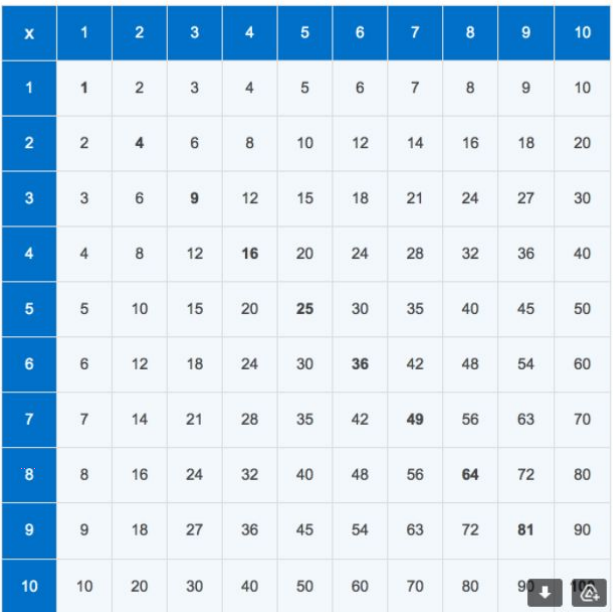

# Korrutustabel
[Avaleht](../../../README.md) > [Praktika](../../README.md) > [Nädal2](../README.md) > Korrutustabel

Kirjuta programm, mis lehe laadides tekitab sellise korrutustabeli:  
  

Kasutage HTML `<table>` elementi.

Tabeli genereerimine peab toimuma Javascripti poolel kasutades table objekti võimalusi: 
https://www.w3schools.com/jsref/dom_obj_table.asp  

Värvid ei pea olema samad.
