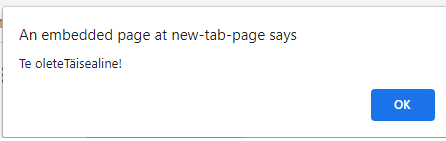
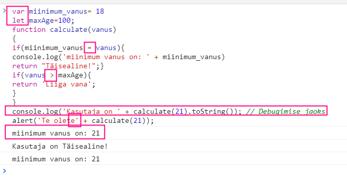
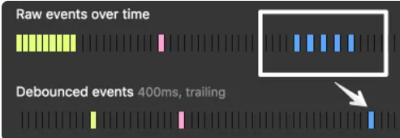

# Kodutöö 4

### Ülesanne 1

##### Vasta küsimustele:
1. Mis on CDN? Kirjuta näide, kus kasutad oma HTML lehel CDN'i mõne CSS ja/või JS faili importimiseks.

DDN (Content Delivery Network) on sisuedastusvõrk, veebisaidi sisu vahemällu salvestamiseks ja edastamiseks
* näide1
```
<head>
<script src="https://ajax.googleapis.com/ajax/libs/jquery/3.5.1/jquery.min.js"></script>
</head>
```

2. Mis on VCS (Version Control System) e versioonihaldus ja mis eesmärke see täidab tarkvaraarenduses? Too näiteid populaarseimatest VCS -dest.

Versioonijuhtimissüsteem võimaldab kasutajatel tarkvaraarendusprojektide muudatusi jälgida ja võimaldab neil nendes projektides koostööd teha. Selle abil saavad arendajad töötada koodi koostöös ja eraldada oma ülesanded harude kaudu. Arendajad saavad vajadusel koodi muudatusi kombineerida. Lisaks saavad nad vaadata muudatuste ajalugu, minna tagasi eelmise(te) versiooni juurde ja kasutada/hallata koodi soovitud viisil. Versioonijuhtimissüsteemi kasutamise peamised eelised hõlmavad arendusprotsessi sujuvamaks muutmist, mitme projekti koodi haldamist ja kõigi muudatuste ajaloo säilitamist koodis.

Populaarseimad VCS-id GitHub, GitLab, Beanstalk, PerForce, Apache Subversion, AWS CodeCommit, Microsoft Team Foundation Server, Mercurial

3. Mis on code-review? Miks seda tehakse? Kes seda tegema peaks?

Hea vastuse leidsin lehelt href= http://agilistiteatmik.wikidot.com/wiki:koodi-uelevaatus-e-code-review , ei hakka siia ümber kirjutama.


### Ülesanne 2 (Teadmiste test)

Tee test: https://www.w3schools.com/quiztest/quiztest.asp?qtest=JavaScript
Ole enda vastu aus - kasuta vaid seni omandatud teadmisi.
Ülesande vastuseks kirjuta saadud tulemus.
#### Testi tulemus:
[Testi tulemus](./result.png) 


### Ülesanne 3 (Javascripti "uuemad" featuurid)

Seni tunnis käsitlemata aga levinud Javascripti konstruktsioonid. Loe viidatud artiklid läbi, proovi seni tehtud praktiliste ülesannete peal kasutada mõnda neist konstruktsioonidest.

* Arrow functions (https://javascript.info/arrow-functions-basics | https://codeburst.io/javascript-arrow-functions-for-beginners-926947fc0cdc)
* Rest operator/parameters (https://www.geeksforgeeks.org/javascript-rest-operator/ | https://javascript.info/rest-parameters-spread)
* Spread operator (https://codeburst.io/javascript-the-spread-operator-a867a71668ca | https://codeburst.io/a-simple-guide-to-destructuring-and-es6-spread-operator-e02212af5831)
* Destructuring assignment  (https://codeburst.io/es6-destructuring-the-complete-guide-7f842d08b98f)

Tsüklid:
Lisaks tunnis käsitletud `do..while`, `while` ja `for` tsüklitele, on Javascripti aja jooksul täiendatud veel teistegi tsüklitega nagu foreach, `for...in`, `for...of` (https://www.youtube.com/watch?v=W8qA83O-IQU).


### Ülesanne 4 (Code-review)

Tarkvaraarenduse meeskondades on levinud praktika teha code-review'sid.

Kujutle, et sinu juhendada on tarkvaraarenduse praktikant, kellele andsid ülesande kirjutada funktsioon vanuse valideerimiseks Javascriptis.

Validaatori nõuded:
* Peab valideerima kas sisestatud vanus on vähemalt 18 (täisealine).
* Peab kontrollima ega vanus ei ole suurem/võrdne 100'ga.
* Kasutaja peab saama tagasisidet.

Praktikant esitab täpselt sellise lahenduse:
```
var miinimum_vanus= 18
let maxAge=100;
function calculate(vanus)
{
if(miinimum_vanus = vanus){
return "Täisealine!";}
if(vanus > maxAge){
return 'Liiga vana';
}
}
console.log('Kasutaja on ' + calculate(21).toString()); // Debugimise jaoks
alert('Te olete' + calculate(21));
```

Kasutades kõiki Javascripti kursusel (kui ka muudes tundides ja iseseisvalt) õpitud teadmisi tehke sellele koodile code-review.

Tooge välja kõik vead (süntaksi vead, nõuetele vastavus, koodistiil, koodi formaatimine, koodi optimaalsus jne) ning pakkuge välja ka omapoolne lahendus, et praktikant seeläbi õpiks.

#### Vigade kirjeldus

* Muutujate defineerimiseks kasutada, kas `let` või `var` aga mitte mõlemaid segamini. Eelistada `let`. Antud näites tuleb kasutada `const`, sest need muutujad peavad olema konstantsed
* Kui koodis kasutatakse vaid korra konstantset muutujat, siis ei ole neid vajadus eraldi deklareerida. (!? pole päris kindel)
* Antu näite korral kasutada `If else_if else` tingimuslauset, mitte ainult `if`-e
* Esimese `if`-i tingimus muudab ära `miinimum_vanus` väärtuse ja omistab sellele väärtuseks 21.
* Teine `if` tingimus ei arvesta sisse ka 100, mis oli nõutud. Siin tuleb asendada `>` -> `>=`
* Ei ole määratud tingimust, mis ütleks, et olen `liiga noor!`, selle asemel hakkas uuesti koodi läbi käima (tudub nii, kui vaadata pilti konsoolist)
* Koodi puhtana hoidmiseks mitte jätta sisse `console.log` ridu, see on vajalik pigem enesekontrolliks
* kasutajale teksti kuvamisel arvestada tühikute asukohaga ja kui tegemist liitmisega, siis ka arvestada seda, et keset lauset ei oleks suure algustähega sõna(v.a., kui see peabki nii olema)



Näitamaks, et `miinimum_vanuse` väärtus muutub 18 -> 21, lisasin koodile rea `console.log("miinimum vanus on: " + miinimum_vanus)`

 

#### Parandatud kood:
```
function calculate(vanus) {
    if (vanus < 18) {
        return 'liiga noor!';
    } else if (vanus >= 100) {
        return 'liiga vana!';
    } else {
        return 'täisealine!';
    }
}
alert('Te olete ' + calculate(21));
```
[Kood](./codereview.js)

### Ülesanne 5 (Levinud praktikad)

Lugege järgnevat artiklit: https://medium.freecodecamp.org/3-questions-to-watch-out-for-in-a-javascript-interview-725012834ccb

##### Vastake küsimustele:
#### * Mis on event delegation ja mis juhtudel ta hea on?
##### Vastus:
Selle asemel, et määrata igale indviduaalsele üksusele eraldi event listener, määratakse üks event listener kogu konteinerile. 
Seda on mõislik kasutda siis, kui on palju(rohkem, kui 10) individuaalseid üksusi, mida on vaja event listeneriga välja kutsuda.

#### * Mis on closure?
##### Vastus:
Closuer on see, kui sisemisel funktsioonil on juurdepääs välisele muutujale väljaspool oma skoopi.

#### * Mis on throttling? Milleks see hea on?
##### Vastus:
Throttling jõustab funktsiooni maksimaalse arvu kordi, mida saab aja jooksul kutsuda. 
```
 10s * 1,000) = 10,000ms
10,000ms / 100ms throttling = 100 maksimum kutset
```
Seda kasutatakse siis, kui on vajadus piirata funktsiooni käivitamist.

#### * Mis on debouncing? Milleks see hea on?
##### Vastus:
Debouncing jõustab funktsiooni vaid kindla tegevuse lõpetamisel.
Debounce'i tehnika võimaldab meil "rühmitada" mitu järjestikust kutset ühte.
 
Ressursside optimeerimiseks.
 

### Ülesanne 6 (jQuery)

* Mis on üks kõige enam kasutatud javascripti teek jQuery?

Annab võimaluse lihtsalt saada ligipääs igale DOM elemendile, teha pöördumist DOM atribuutidele ja manipuleerida nendega. Lisaks võimaldab jQuery töödeldada erinavaid sündmusi ning luua animatsioone ja visuaalseid effekte.

* Too välja selle head küljed võrreldes VanillaJS'ga.

Eeliseks on see, et ei teki konflikti teiste funktsioonidega,  jQuery teeki on mugav kasutada ja kombineerida teiste programmeerimiskeeltega. 

* Too välja ka mõned miinused jQuery kasutamisel.

Kõik ei ole ehitatud tavalise standardi järgi.
Suur hulk versioone. Mõned versioonid toimivad hästi teistega mõned mitte.

###### Kirjuta lihtne HTML leht, kus oled lehele importinud jQuery teegi ja kasutad seda koodis suvalisel eesmärgil.

Näiteks kasutad jQuery stiilis selectorite abi HTML elemendi valimiseks koodis ja sisu muutmiseks vms.

  - Vihje 1: https://gist.github.com/joyrexus/5322252
  - Vihje 2: https://www.w3schools.com/jquery/jquery_get_started.asp
  - Vihje 3: https://www.youtube.com/watch?v=X65s7WQLWJY
  - Vihje 4: https://learn.onemonth.com/jquery-vs-javascript/

#### Vastuskood

[jQuery](./index.html) 


### Ülesanne 7 (Valikuline ülesanne - veebipoe parandused)

Proovige lahendada eelnevate aastate Javascript kursuse kontrolltööd. Sel aastal on kontrolltöö teistsugune.
Esitage enda lahendus (kui proovisite lahendada) ja lisaks kirjutage tagasisideks kuidas teile selline ülesanne tundus (keeruline, lihtne, soovitusi, parandusi jms).

#### Ülesanne järgmine:
 
##### Kontrolltöö stsenaarium:

Lõid äsja oma tarkvaraettevõtte ja sinu esimeseks kliendiks on väikese kaubavalikuga pudi-padi ja suveniiride kaupluste kett Ameerika Ühendriikides.
Kliendi mureks on üks Javascriptil põhinev kassaprogramm, mis teatud situatsioonides arvutab kogusummat valesti. Sinu ülesanne on teha kindlaks veakoht ning parandada algoritm, mis arvutusi teostab.

Klient ega ka sina ei saa programmi autori abile loota, sest see põgenes USA maksuameti eest Põhja Koreasse ja sattus seal veganluse propageerimise eest sunnitöölaagrisse.
Kliendil on ka soov väikeste lisafeatuuride järele, mis on üsna triviaalsed.

Sul on lahenduse jaoks väga piiratud aeg, sest peagi algab turismihooaeg ning kliendil on vaja müüki jätkata peagi saabuvate Mehhiko turistide hordidele. 
Sa ei soovi oma ettevõttest halba muljet jätta ja nõustud antud tähtajaga. 

Ülesande failid asuvad SIIN.

- Kirja manuses viimane kliendi e-mail (EMAIL.txt), kust leiate kliendi soovid ja ka mõned kasulikud vihjed.
- Antud kontrolltöö raames HTMLi ja CSSi muuta ei ole vaja. 
- Kogu töö peab käima Javascripti poolel (js faililaienditega failides ja ka HTML <script> tagide sees, kui peate seda vajalikuks).
- jQuery kasutamine on keelatud.  jQuery on vajalik üksnes lehel kasutatud Bootstrap raamistiku toimimiseks. 
- Rakendus peab töötama värskeima Google Chrome veebilehitseja versiooniga.
- IDE (NetBeans, VS Code vms), Google Chrome Developer tools kasutamine on lubatud ja soovituslik.

* Aega on täpselt 2 tundi. Ülesanne on koostatud nii, et etteantud aja jooksul on võimalik kõik toimingud liigselt kiirustamata täita.
* Töö käigus võib kasutada kõiki materjale.
* Esitatud peab olema täielik lahendus (kõik failid).
  
#### Hindamiskriteeriumid:
#### Baasnõuded:
* Kood peab olema korrektselt trepitud (kasutage IDE autoformat).
* Kood peab järgima olemasolevat koodistiili, olema loogiline, lihtsalt loetav ja optimaalne.
* Esitatud lahendus ei tohi sisaldada console (console.log() vms) funktsioone.
* Esitatud lahendus ei tohi sisaldada TODO/FIXME kommentaare. Kommentaare ei ole üldse soovitav koodi sisse jätta.
* Esitatud lahendusega peab olema kaasas nii minified kui ka developer version (non-minified) e shop.js fail, mis toimivad identselt.
* Esitatud töö HTML peab kasutama minified ressurssi (shop.min.js). JS online minify tööriist: https://skalman.github.io/UglifyJS-online/
* Rakenduse käivitamisel ei tohi konsooli tekkida vigu ega muid takistusi rakenduse töös.

Kui eelnevad nõuded on täidetud, siis positiivse hinde saamiseks on vajalik, et: 
* Rakendus arvutab kogusummat (maksude ja soodustustega) korrektselt.
* Rakendust on korrektselt täiendatud vähemalt ühe kliendi poolt soovitud lisafeatuuriga.

Õpilane peab vajadusel olema valmis enda lisatud lahendusi selgitama.
